# Programación Estocástica

- Un programa es determinístico si cuando se corre con el mismo input produce el mismo output
    - Hay problemas que no se pueden resolver mediante programas determinísticos
- Programas estocásticos permite introduccir aleatoriedad

    - Resolver problemas y simulaciones más adecuadas
    - Distribuciones probabilísticas de un problema -> Estimaciones

Ejemplo de problema:

- Generar un programa para controlar los semaforos

  - Deterministicos -> Parametros -> Desicion
    - Patrones -> Datos estadísticos-> Distribuciones de probabilidad -> Desición
      - Responder mucho mejor

> Cambio de forma de ver un problema

## Calculo de Probabilidades

¿Cómo calcular probabilidades?

- Probabilidad: Medida de la certidumbre asociada a un evento o suceso futuro y siempre es un numero de 0 a 1

  - 0 jamas sucede el evento
  - 1 garantizado de suceder en el futuro

- Preguntamos: ¿Qué fracción de todos los posibles eventos tiene la propiedad  que buscamos
  - Se deben calcular todas la posibilidades de un evento 
  - Enumerar todas las posibilidades (Brute force)
> La probabilidade de que un evento suceda y mas la probabilidad de que no suceda es siempre 1

### Leyes
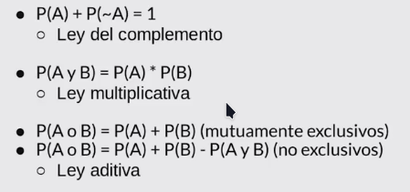

- Ley multiplicativa -> 'And'
  - Funciona para eventos mutuamente excluyentes o no
- Ley aditiva -> 'Or'
  - Cambia si los eventos son mutuamente excluyentes

Nota: 
- Metodo analítico -> Pensar de manera matematica las probabilidades

- Método empírico -> Simulación de lso eventos para mirar las probalidades de manera práctica

## Inferencia Estadística

Simulación para calcular probabilidades de eventos complejos sabiendo las probabilidades de eventos simples

- ¿Qué pasa cuando no sabemos las probabilidades de los eventos simples?

- Técnicas de la inferencia estadística nos permite inferir/concluir las propiedades de una población a partir de una muestra aleatoria

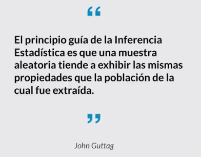
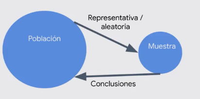

Resolver problemas sin tener que realizar todos los computos del data set.

Al sacar varias muestras en diferentes momentos la probabilidad de que sea una muestra representativa de la población aumenta. La media de la poblacion se asemeja a la media de la muestra, con algunas variaciones 
  - Varianza
  - Desviacion estandar

**Ley de los grandes números**

- En pruebas independientes repetidas con la misma probabilidad p de un resultado, la fracción de desviaciones de p converge a cero conforme la cantidad de pruebas se acerca al infinito

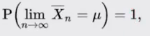

*Falacia del apostado*:

- Señala que después de un evento extremo, ocurrirán eventos menos extremos para nivelar la media
  - Cada evento es independiente

- La *regresión a la media* señala que después de un evento aleatorio extremo, el siguiente evento probablemente será menos extremo

## Media 

Es una medida de la tendencia central

- Conocida como el promedio

- Se denota con el simbolo  miu(alfabeto griego)

- La media de una muestra se denota con X barra.

- 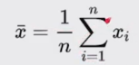

## Varianza y Desviación Estándar

**Varianza**: 

- Es una medida de propagación: ¿Qué tan propagados se encuetran los valores de la media?

- Dispersion de los datos

- La varianza con respectoa a la media 
- 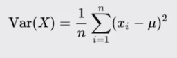

  - Se generan las diferencias de la muestra con la media y se eleva al cuadrado para evitar tener valores negativos.
  - Tambien al elevarlo al cuadrado, la dispersión es amyor cuando se aleja de la media y lo mismo aplica para el caso contrario

**Desviación estándar**:

- Es la raiz cuadrada de la varianza

- Permite entender la propagación en las mismas unidades de la media

- 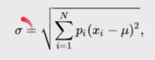

## Distribución Normal

- De las distribuciones más recurrentes en cualquier ámbito

- Se puede definir completamente por su media y su desviación estandar

- Calcular intervalos de confianza con la *regla empírica*

- 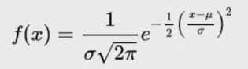

  - Solo se necesitan solo dos parametros para definir la distribución normal

Ejemplo:

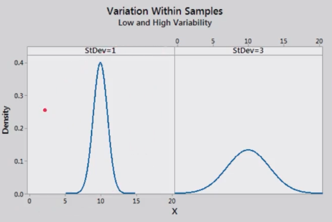

- En este caso las dos distribuciones normales tiene la misma media pero diferente desviación estándar

**Regla empírica**:
- Regla del 68-95-99.7

- Señala cuál es la dispersion de los datos en una distribucion normal a uno,dos y tres sigmas (desviaciones estándar)

- 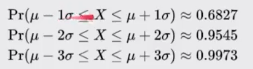

Zonas en las cuales se encuentra la mayor cantidad de muestras
- 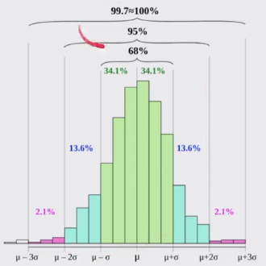