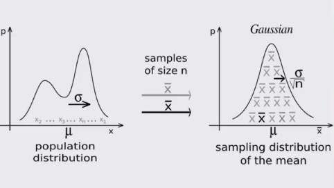

# Muestreo e Intervalos de confianza

## Muestreo

- Se usa en las ocaciones a las que no tenemos acceso a toda la población que queremos explorar

- Las muestras aleatorias tienden a mostas las mismas propiedades de la población objetivo (Inferencia estadística)

  - Se pueden generar conclusiones válidas a partir de las muestras

- Tipo de muestre hasta ahora:

  - Muestreo probabilístico

Tipos de muestreo:

- Muestreo aleatorio: Cualquier miembro de la poblacióin tiene la misma probabilidad de ser escogido

- Muestreo estratificado: Tomamos en consideracion las características de la población para partirla en subgrupos y luego tomamos muestras de cada subgrupo

  - Aumenta la probabilidad de que el muestreo sea representativo de la población 

## Teorema del Límite Central

Uno de los teoremas mas importantes de la estadística

- Establece que muestras aleatorias de cualquier distribucion van a tener una distribución normal

- Permite entender cualquier distribución normal de sus medias y eso nos permite aplicar todo lo que sabemos de distribuciones normales

- Al ir tomando datos de manera aleatoria de cualquier distribucion, los datos se van promediando con los anteriores

- Entre mas muestras se tomen, el resultado será mas parecido a una distribucion normal
    - Desviacion estandar menor

Ejemplo:

- En general trabajar con distribuciones de probabilidad diversas es difícil, por otro lado la distribucion normal esta muy bien estudiada por lo que al convertir una distribucion desconocida en una normal entonces es posible sacar conclusiones importantes con respecto a la distribucion original 